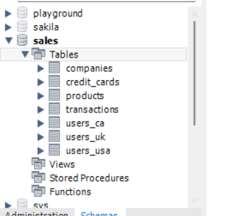
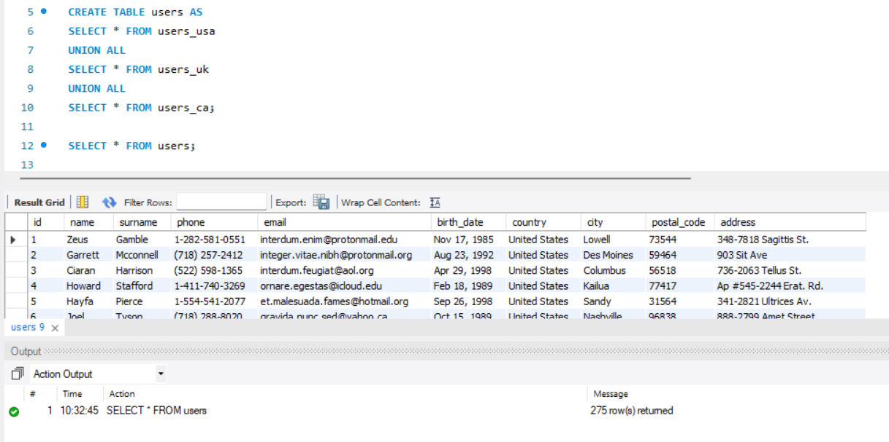
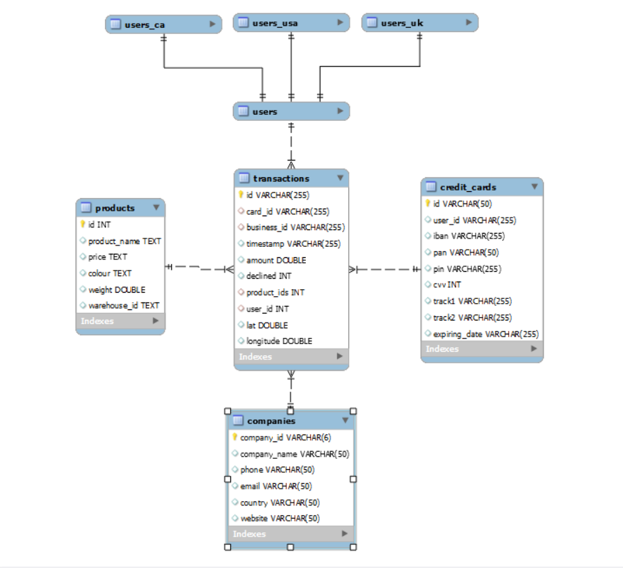

### Sprint 4 : Creacion base de datos

Para crear la base de datos utilizo el comando

```CREATE DATABASE sales```     

Para cargar las los archivos csv con la información, utilizo el "table import wizard".

Finalemente el esquema queda así:




### Sprint 4 : Unificar tablas _users_

Tenemos 3 tablas que se relacionan con la tabla de hechos _**transactions**_. Las tres tablas contiene la misma informacion, por lo que es posible unificar las tablas en una sola llamada _**users**_.




### Sprint 4 : Relacion de base de datos

En segundo paso, lo que hago es definir las Primary key de las distintas tablas, para generar relaciones_




voy a unificar los estilos de las variables para lograr establecer la relacion 1:n,, etc, etc