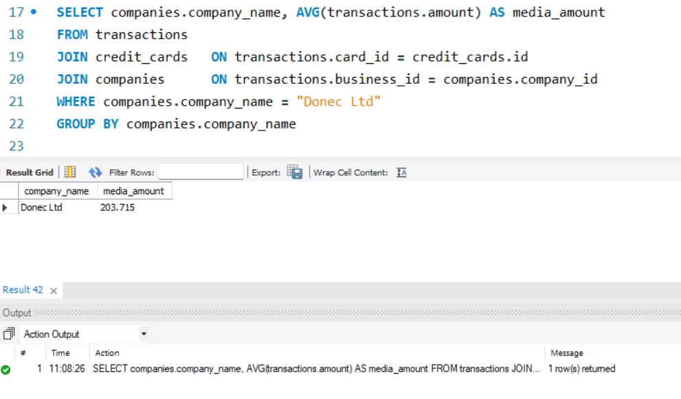

# Sprint 4 - Nivel 1
## Exercici 1

Realitza una subconsulta que mostri tots els usuaris amb més de 30 transaccions utilitzant almenys 2 taules.

## Exercici 2
Mostra la mitjana de la suma de transaccions per IBAN de les targetes de crèdit en la companyia Donec Ltd. utilitzant almenys 2 taules.

# Sprint 4 - Nivel 2

Crea una nova taula que reflecteixi l'estat de les targetes de crèdit basat en si les últimes tres transaccions van ser declinades i genera la següent consulta:

## Exercici 1
Quantes targetes estan actives?

# Sprint 4 - Nivel 3

Crea una taula amb la qual puguem unir les dades del nou arxiu products.csv amb la base de dades creada, tenint en compte que des de transaction tens product_ids. Genera la següent consulta: 

Exercici 1
Necessitem conèixer el nombre de vegades que s'ha venut cada producte.